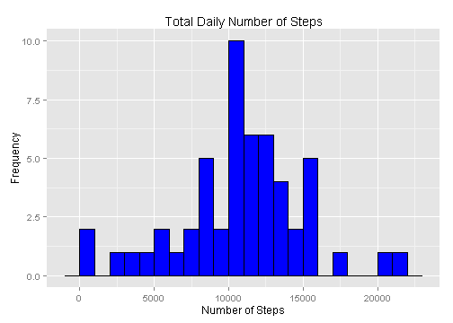
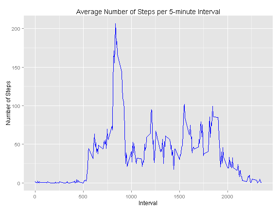
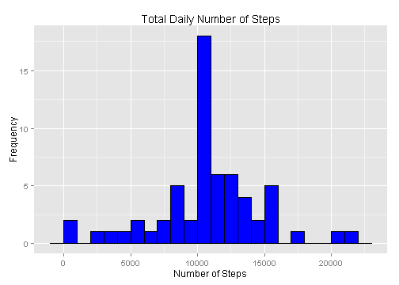
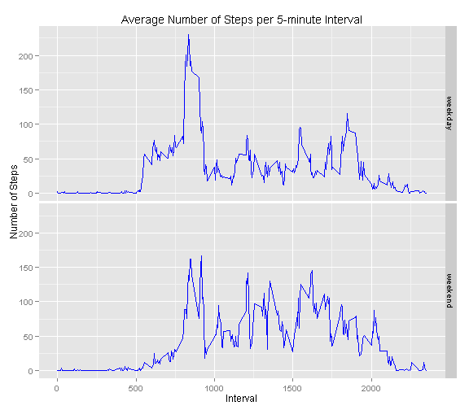

Reproducible Research - Peer Assessment 1
=========================================


The analysis below uses data from a personal activity monitoring device and
computes means and medians of steps taken daily at 5 minute intervals. 


First, I read the data into R and convert the values in the date column to a Date vector.


```r
data <- read.csv("activity.csv", na.strings = "NA", stringsAsFactors = F)
data <- transform(data, date = as.Date(date))
```


### What is the mean total number of steps taken per day?

In order to answer this question, I first generate the total number of steps taken each day. The frequency of these totals are visible in the histrogram below.


```r
daily_step_sum <- aggregate(steps ~ date, data = data, sum)

library(ggplot2)
ggplot(daily_step_sum, aes(x=steps)) + geom_histogram(binwidth=1000, 
    colour="black", fill="blue") + labs(x = "Number of Steps", y = "Frequency", 
    title = "Total Daily Number of Steps")
```

 

Then I calculate the mean and median across these totals.


```r
options(scipen=1, digits=2)
step_mean <- mean(daily_step_sum$steps)
step_median <- median(daily_step_sum$steps)
```

So the mean of the total number of steps per day is **10766.19**, while the median is equal to **10765**.


### What is the average daily activity pattern?

In order to see this I generate a new data frame with the average number of steps per 5-minute interval. The resulting data is used to create the time series plot (see below).


```r
avg_per_interval <- aggregate(steps ~ interval, data = data, mean)

ggplot(avg_per_interval, aes(interval, steps)) + geom_line(colour = "blue") + 
    labs(x = "Interval", y = "Number of Steps", 
    title = "Average Number of Steps per 5-minute Interval")
```

 

Next, I determine the maximum value for the average number of steps and use it to filter on the 5-minute interval corresponding to the value.


```r
max_avg <- max(avg_per_interval$steps)
intvl_max_steps <- avg_per_interval[avg_per_interval$steps == max_avg, 1]
```

The interval with the highest step average is **835**.


#### Imputing missing values


```r
NA_count <- length(data[data$steps == "NA", 1])
```

The number of missing values in the dataset is **2304**.

In order to fill in the data, I resorted to the means calculated for the 5-minute intervals.


```r
library(dplyr)
names(avg_per_interval)[2] <- "steps_avg"
merged <- merge(data, avg_per_interval, by = "interval")
len <- nrow(merged)
for (i in 1:len) {
    if (is.na(merged$steps[i])) {
        merged$steps[i] <- round(merged$steps_avg[i],2)
    }
}
data_noNAs <- arrange(merged, date)[,1:3]
```

Below is the histogram of the total number of steps per day based on the adjusted values.


```r
daily_step_sum_noNAs <- aggregate(steps ~ date, data = data_noNAs, sum)

ggplot(daily_step_sum_noNAs, aes(x=steps)) + geom_histogram(binwidth=1000, 
    colour="black", fill="blue") + labs(x = "Number of Steps", y = "Frequency", 
    title = "Total Daily Number of Steps")
```

 

Next, I recalculate the mean and median with the filled-in values.


```r
step_mean_noNAs <- mean(daily_step_sum_noNAs$steps)
step_median_noNAs <- median(daily_step_sum_noNAs$steps)
```

The new mean is **10766.18**, while the median is **10766.13**. We can see that the mean is almost unchanged, while the median has increased slightly.


### Are there differences in activity patterns between weekdays and weekends?


In order answer this question, I first tag the days based on this distinction.


```r
for (i in 1:len) {
    if (weekdays(data_noNAs$date[i]) %in% c("Saturday", "Sunday")) {
        data_noNAs$day_type[i] <- "weekend"} 
    else {
        data_noNAs$day_type[i] <- "weekday"}
    }
data_noNAs$day_type <- factor(data_noNAs$day_type)
```

The changes in the average number of steps across weekdays and weekends can be seen in the plot below.


```r
avg_per_day_type <- aggregate(steps ~ interval + day_type, 
                    data = data_noNAs, mean)

ggplot(avg_per_day_type, aes(interval, steps)) + geom_line(colour = "blue") + 
    facet_grid(day_type ~ .) + labs(x = "Interval", y = "Number of Steps", 
    title = "Average Number of Steps per 5-minute Interval")
```

 

